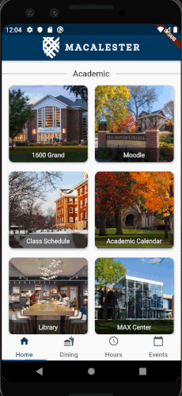

# MacMobile

MacMobile is a cross-platform mobile app that is developed using Flutter. This application consolidates
the important information for members of the Macalester College community, such as the dining hall hours,
the facility hours, the academic resources, and the daily events.

## App Structure

The app is structured into four tabs: Home, Dining, Hours, and Events. The home page includes numerous
buttons that contain links to many of the important online resources at Macalester, such as Moodle and
1600 Grand.

The dining tab displays the daily hours of the dining options on campus as well as whether each option
is open or closed. This page also contains buttons that lead to the Bon Appetit website, which displays
the daily menus.

The hours tab presents the hours of the popular facilities on campus and notes whether each is open. It
also gives the phone numbers, locations, and websites of each facility. The information for the dining and
hours tabs are stored in Firebase.

Finally, the events tab uses the Google Calendar API to present the daily on-campus events in a
calendar. The design of the calendar was inspired by the MIT license in the following Github
repository https://github.com/tsmith1024/calendar_view_widget.

## Code Structure

The source code for this app is organized into pages and helpers. The files that are in the pages
folder are those that are directly called by main.dart and are used to create the four different tabs.
For example, dining.dart programs the design of the dining page which is displayed on the app.

The files in the helpers folder assist those in the pages folder by either storing data, interacting
with Firebase, making API calls, or specifying certain design aspects. As an example, the eventTabPage.dart
file in the pages folder programs the events tab on the app. However, in the helpers folder, the
eventAPI.dart file calls the Google Calendar API and sorts the events, the eventsView.dart file
implements the design of the events, the monthView.dart file designs the days in the calendar, the
calendarView.dart implements the overall calendar design, and the calendarView.dart file implements
much of the important UI, such as switching between months in the calendar.

All files outside of the lib folder were provided by Flutter or Firebase.

## Installing

To install and run this repository on your computer, a coding software such as Android Studio (recommended)
or Visual Studio Code must be installed on your computer. Additionally, you should follow the instructions
on the Flutter website (https://flutter.dev/docs/get-started/install) to install Flutter and mobile
emulators. Then by cloning this repository into your coding software and running it on a mobile emulator,
you should be able to easily run the application. This app is currently not available for mobile distribution
on the App Store, but we hope for this to be possible in the future.

## Authors

Ellen Chen, Lu Li, Yiming Miao, Zachary Fried

## Acknowledgements

* Shilad Sen
* Macalester College
* COMP-225 Classmates
* MIT License
